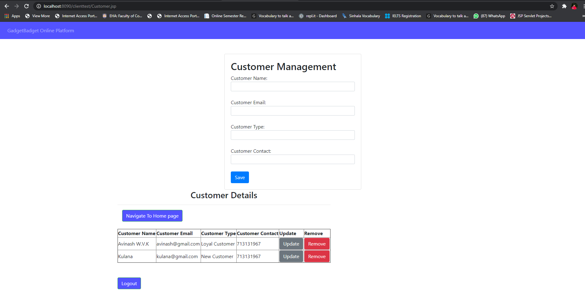

# GadgetBadget Clientside 

# About my project?
My project is based on a company who funds the inventors to build their precious products and also help them to sell the products in companies online platform.I have implemented 3 functions in this system and they are customer function, payment function and login function.

#  The technologies we used were
java JAX-RS(jersy) Restful web service on Apache  Tomcat  mysql as the database and eclipse as the IDE.

# How to execute the project?
Import the gadgetbadget_clientside DB then clone the project and after it become cloned by using apache tomcat server the project can be executed. Execute the Login.jsp file through apache tomcat server and when the administration login user interface appear give the username and password which have been stated below.

-  Username: avinash
-  Password :123

#  Link  To GadgetBadget_clientside Database
https://github.com/kulanaavinash/GadgetBadget-ClientSide/blob/main/Database/gadgetbadget_clientside.sql

#  Developer

-  Avinash W.V. K          --IT19091426

# Screenshot of the UI

<h1>Administrator Login page</h1>

<h1>Homepage</h1>

<h1>Payment Management</h1>

<h1>Customer Management</h1>

   

